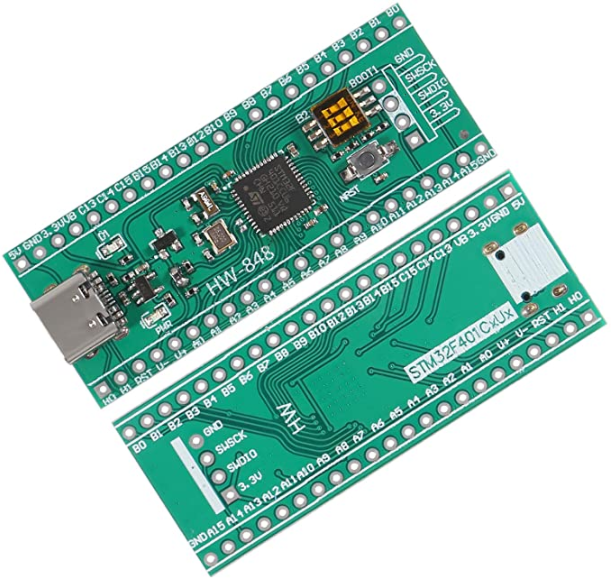

# STM32F401CCU6
A repository of information related to the Green version of the STM32 Black Pill. I purchased this board from Amazon, but it is likely avaliable from other vendors.
## Other Labels
HW-848 STM32F401CxUx

## Pinout
The naming of these pins are rather intuitive with the pin numbers being in order, as opposed to some other boards where the numberings are seemingly more random.

## Acknowledgements
The coloring/design for the excel document is based on one previously done by Richard-Balint.

[STM32F401CB Datasheet](https://www.st.com/resource/en/datasheet/stm32f401cb.pdf)
